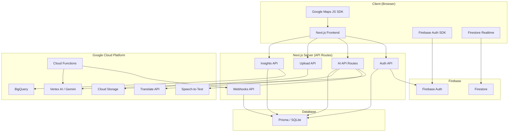

# KarigarSetu — Architecture Documentation

## System Architecture

KarigarSetu is a full-stack Next.js application powered by Google Cloud services.



## Service Dependency Map

| Service | Purpose | Fallback | Env Var Check |
|---------|---------|----------|---------------|
| Vertex AI | AI generation (listing, heritage, pricing, trends) | Direct Gemini SDK (`@google/generative-ai`) | `GCP_PROJECT_ID` |
| Cloud Storage | Product image uploads | Cloudinary → Local filesystem | `GCS_BUCKET_NAME` |
| Firebase Auth | Google Sign-In | JWT email/password auth | `NEXT_PUBLIC_FIREBASE_API_KEY` |
| Firestore | Real-time orders, messaging | Prisma polling | `NEXT_PUBLIC_FIREBASE_PROJECT_ID` |
| BigQuery | Market intelligence analytics | Prisma aggregation queries | `BIGQUERY_DATASET` |
| Speech-to-Text | Voice transcription | Browser SpeechRecognition API | `GCP_PROJECT_ID` |
| Translate API | Text translation | Gemini AI translation | `GOOGLE_TRANSLATE_API_KEY` |
| Google Maps | Map visualization | Leaflet + OpenStreetMap | `NEXT_PUBLIC_GOOGLE_MAPS_API_KEY` |
| Cloud Functions | Serverless AI pipelines | In-process execution | `CLOUD_FUNCTION_*_URL` |

## Data Flow

### Product Upload Pipeline
```
Artisan uploads photo
  → /api/upload (GCS → Cloudinary → Local)
  → /api/ai/analyze-image (Vertex AI vision)
  → /api/ai/generate-listing (Vertex AI text)
  → Cloud Function trigger (async)
  → Webhook saves results to Prisma
```

### Voice Onboarding Flow
```
Artisan taps mic → Browser MediaRecorder
  → Browser SpeechRecognition (live preview)
  → /api/ai/speech-to-text (Google Cloud STT)
  → Transcript populates form fields
```

### Translation Flow
```
User selects language → /api/ai/translate
  → Google Translate API (cached, with language detection)
  → Fallback: Gemini AI translation
  → Cached result returned
```

## Feature Flags

All Google Cloud integrations are behind feature flags in `src/lib/featureFlags.ts`. When env vars are missing, the app falls back to existing behavior with zero code changes.

## File Structure (New Files)

```
src/lib/
├── googleCloud.ts        # GCP service account auth
├── featureFlags.ts       # Cloud service toggle flags
├── cloudStorage.ts       # GCS upload helper
├── firebaseAdmin.ts      # Server-side Firebase Admin
├── firebase.ts           # Client-side Firebase config
├── firestore.ts          # Firestore real-time helpers
├── cloudFunctions.ts     # Cloud Function triggers
├── bigquery.ts           # BigQuery analytics + Prisma fallback
├── speechToText.ts       # Google Cloud STT helper
├── translateApi.ts       # Google Translate API + caching
└── ai/
    ├── vertexClient.ts   # Vertex AI SDK client + retry logic
    ├── client.ts         # Unified AI model (Vertex AI ↔ Gemini)
    └── translation.ts    # Updated with Translate API fallback

src/app/api/
├── auth/firebase/        # Firebase token verification
├── insights/
│   ├── demand/           # Demand by region
│   ├── trends/           # Seasonal trends
│   └── pricing/          # Pricing benchmarks
├── webhooks/
│   └── cloud-functions/  # Cloud Function result webhooks
└── ai/
    └── speech-to-text/   # Audio transcription

src/components/
├── GoogleMapInner.tsx    # Google Maps JS SDK component
├── CraftOriginMap.tsx    # Updated with Maps fallback
└── VoiceInput.tsx        # Updated with STT integration
```
