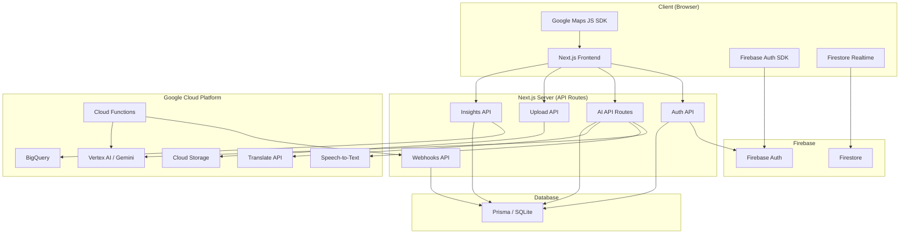

# KarigarSetu — Architecture Documentation

## System Architecture

KarigarSetu is a full-stack Next.js application powered by Google Cloud services.



## Service Dependency Map

| Service | Purpose | Fallback | Env Var Check |
|---------|---------|----------|---------------|
| Vertex AI | AI generation (listing, heritage, pricing, trends) | Direct Gemini SDK (`@google/generative-ai`) | `GCP_PROJECT_ID` |
| Cloud Storage | Product image uploads | Cloudinary → Local filesystem | `GCS_BUCKET_NAME` |
| Firebase Auth | Google Sign-In | JWT email/password auth | `NEXT_PUBLIC_FIREBASE_API_KEY` |
| Firestore | Real-time orders, messaging | Prisma polling | `NEXT_PUBLIC_FIREBASE_PROJECT_ID` |
| BigQuery | Market intelligence analytics | Prisma aggregation queries | `BIGQUERY_DATASET` |
| Speech-to-Text | Voice transcription | Browser SpeechRecognition API | `GCP_PROJECT_ID` |
| Translate API | Text translation | Gemini AI translation | `GOOGLE_TRANSLATE_API_KEY` |
| Google Maps | Map visualization | Leaflet + OpenStreetMap | `NEXT_PUBLIC_GOOGLE_MAPS_API_KEY` |
| Cloud Functions | Serverless AI pipelines | In-process execution | `CLOUD_FUNCTION_*_URL` |

## Data Flow

### Product Upload Pipeline
```
Artisan uploads photo
  → /api/upload (GCS → Cloudinary → Local)
  → /api/ai/analyze-image (Vertex AI vision)
  → /api/ai/generate-listing (Vertex AI text)
  → Cloud Function trigger (async)
  → Webhook saves results to Prisma
```

### Voice Onboarding Flow
```
Artisan taps mic → Browser MediaRecorder
  → Browser SpeechRecognition (live preview)
  → /api/ai/speech-to-text (Google Cloud STT)
  → Transcript populates form fields
```

### Translation Flow
```
User selects language → /api/ai/translate
  → Google Translate API (cached, with language detection)
  → Fallback: Gemini AI translation
  → Cached result returned
```

## Feature Flags

All Google Cloud integrations are behind feature flags in `src/lib/featureFlags.ts`. When env vars are missing, the app falls back to existing behavior with zero code changes.

## File Structure (New Files)

```
src/lib/
├── googleCloud.ts        # GCP service account auth
├── featureFlags.ts       # Cloud service toggle flags
├── cloudStorage.ts       # GCS upload helper
├── firebaseAdmin.ts      # Server-side Firebase Admin
├── firebase.ts           # Client-side Firebase config
├── firestore.ts          # Firestore real-time helpers
├── cloudFunctions.ts     # Cloud Function triggers
├── bigquery.ts           # BigQuery analytics + Prisma fallback
├── speechToText.ts       # Google Cloud STT helper
├── translateApi.ts       # Google Translate API + caching
└── ai/
    ├── vertexClient.ts   # Vertex AI SDK client + retry logic
    ├── client.ts         # Unified AI model (Vertex AI ↔ Gemini)
    └── translation.ts    # Updated with Translate API fallback

src/app/api/
├── auth/firebase/        # Firebase token verification
├── insights/
│   ├── demand/           # Demand by region
│   ├── trends/           # Seasonal trends
│   └── pricing/          # Pricing benchmarks
├── webhooks/
│   └── cloud-functions/  # Cloud Function result webhooks
└── ai/
    └── speech-to-text/   # Audio transcription

src/components/
├── GoogleMapInner.tsx    # Google Maps JS SDK component
├── CraftOriginMap.tsx    # Updated with Maps fallback
├── VoiceInput.tsx        # Updated with STT integration
├── ShareButton.tsx       # Web Share API + clipboard fallback + analytics
├── WishlistButton.tsx    # Heart-toggle for wishlist (localStorage) + analytics
├── ProductReviews.tsx    # Star ratings & review submission UI + analytics
├── ProductJsonLd.tsx     # Structured data for product pages
├── Breadcrumb.tsx        # Breadcrumb navigation with JSON-LD structured data
├── ProductViewTracker.tsx # Tracks product views in recently viewed + analytics
├── RecentlyViewed.tsx    # Grid display of recently viewed products
├── AddToCartButton.tsx   # Cart button with analytics tracking
└── ErrorBoundary.tsx     # React error boundary component

src/hooks/
├── useWishlist.ts        # localStorage-backed wishlist state
├── useRecentlyViewed.ts  # localStorage-backed recently viewed products
└── useKeyboardShortcuts.ts # Configurable keyboard shortcut handler

src/lib/
├── analytics.ts          # Lightweight analytics event tracker (sendBeacon)
├── emailTemplates.ts     # HTML order confirmation email template
├── rate-limiter.ts       # API rate limiting
├── sanitize.ts           # Input sanitization
├── schemas.ts            # Zod validation schemas
└── webVitals.ts          # Core Web Vitals reporter

src/app/
├── print.css             # Print-friendly @media print styles
├── sitemap.ts            # Dynamic sitemap from database
├── error.tsx             # Global error page
├── not-found.tsx         # 404 page
└── loading.tsx           # Loading skeleton

src/app/api/
├── reviews/              # GET + POST product reviews (Prisma)
```

## Progressive Web App (PWA)

The app includes full PWA support:
- `public/manifest.json` — Web App Manifest with installable config
- `public/sw.js` — Service worker for offline caching
- `public/icons/` — SVG icons (192px, 512px, apple-touch-icon)
- Meta tags in `layout.tsx` for theme color, standalone display, and icon links

## SEO & Discoverability

- **Per-page metadata** via Next.js `Metadata` / `generateMetadata` on every route (products, artisans, marketplace, impact, heritage, onboarding, dashboard)
- **Dynamic sitemap** (`src/app/sitemap.ts`) includes all product pages from DB
- **Product JSON-LD** structured data for rich search results
- **Breadcrumb JSON-LD** via `Breadcrumb` component on product & artisan pages
- **Organization JSON-LD** in root layout
- **Open Graph** + **Twitter Card** tags for social media previews

## Accessibility (ARIA)

Key ARIA improvements across the codebase:
- `FilterSidebar`: `<fieldset>` + `<legend>` for filter groups, `aria-label` on region/category groups
- `DashboardSidebar`: `aria-current="page"` on active nav items, `aria-label` on nav landmark
- `Navbar`: `aria-label="Main navigation"` on `<nav>` element
- `Footer`: `aria-label="Site footer"` on `<footer>` element
- `ProductCard`: Semantic wishlist button with accessible toggle state
- `Breadcrumb`: Semantic `<nav aria-label="Breadcrumb">` with structured data

## User Experience Enhancements

### Recently Viewed Products
- `src/hooks/useRecentlyViewed.ts` — localStorage-backed history (max 12 items)
- `src/components/ProductViewTracker.tsx` — Side-effect component that tracks views
- `src/components/RecentlyViewed.tsx` — Grid display of recently viewed items on product pages

### Keyboard Shortcuts
- `src/hooks/useKeyboardShortcuts.ts` — Configurable keyboard shortcut handler
- Marketplace: `Ctrl/⌘+K` focuses search, `Escape` clears search

### Analytics Event Tracking
- `src/lib/analytics.ts` — Lightweight event tracker with `sendBeacon` (production) and `console.log` (dev)
- Tracks: product views, add-to-cart, wishlist toggles, shares, searches, reviews, AI usage, order completion
- Wired into: `AddToCartButton`, `ShareButton`, `WishlistButton`, `ProductReviews`, `ProductViewTracker`, marketplace search

### Email Notifications
- `src/lib/emailTemplates.ts` — Responsive HTML order confirmation email template with KarigarSetu branding

### Print-Friendly CSS
- `src/app/print.css` — `@media print` styles hiding nav, footer, buttons; optimizing product detail layout

## Testing

**120 tests** across 12 test files using Vitest + Testing Library:

| Test File | Tests | Coverage |
|-----------|-------|----------|
| `lib/sanitize.test.ts` | 16 | Input sanitization, XSS prevention |
| `lib/schemas.test.ts` | 21 | Zod validation schemas |
| `lib/featureFlags.test.ts` | 16 | Feature flag detection |
| `lib/impactCalculator.test.ts` | 7 | Artisan impact calculations |
| `lib/auth.test.ts` | 4 | Auth middleware utilities |
| `lib/ai/client.test.ts` | 6 | Gemini AI client initialization |
| `lib/analytics.test.ts` | 12 | Analytics event tracking |
| `lib/emailTemplates.test.ts` | 9 | Order confirmation email generation |
| `hooks/useWishlist.test.ts` | 6 | Wishlist localStorage hook |
| `hooks/useRecentlyViewed.test.ts` | 6 | Recently viewed localStorage hook |
| `api/reviews.test.ts` | 9 | Product reviews API |
| `types/order.test.ts` | 8 | Order type definitions |

Run: `npx vitest run`
